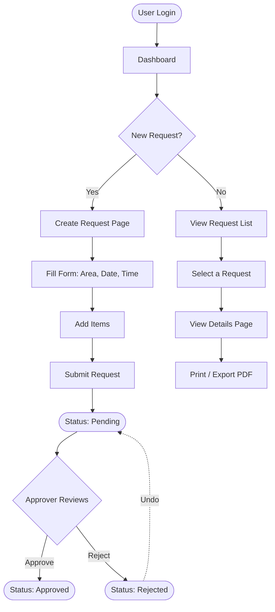

# Process Flow Diagram

```mermaid
flowchart TD
    Start([User Login]) --> Dashboard[Dashboard]

    Dashboard --> CreateBtn{New Request?}
    CreateBtn -->|Yes| Create[Create Request Page]
    CreateBtn -->|No| ViewList[View Request List]

    Create --> FillForm[Fill Form: Area, Date, Time]
    FillForm --> AddItems[Add Items]
    AddItems --> Submit[Submit Request]
    Submit --> Pending([Status: Pending])

    ViewList --> SelectReq[Select a Request]
    SelectReq --> ViewDetails[View Details Page]

    Pending --> ApproverReview{Approver Reviews}
    ApproverReview -->|Approve| Approved([Status: Approved])
    ApproverReview -->|Reject| Rejected([Status: Rejected])
    Rejected -.->|Undo| Pending

    ViewDetails --> Print[Print / Export PDF]
```

## Roles

- **Staff**: Login → Dashboard → Create Request → Submit
- **Approver**: Login → Dashboard → Review → Approve/Reject
